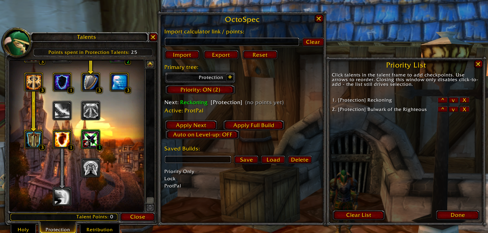

# OctoSpec

A talent helper for OctoWoW that makes importing, viewing, and applying talent builds less painful.

OctoSpec lets you import talent calculator strings, highlights the next talent you should take, prioritizes what to spend points on, and can auto-apply talents for you when you level up or when you ask it to.

### Features

* Import builds from the talent calculator
* Export your full planned build or current talents to the talent calculator
* Highlights and marks the next suggested talent from your build
* Auto-apply talents on level up
* Apply next talent
* Apply full build
* Save / load multiple builds
* Create a custom build path using the priority list
* Create a custom build path within an imported build using a mix of imported build and priority list

### How to use

1. Open the OctoSpec window (minimap button or `/os`).
2. Paste a full calculator URL or the `points=` string into the import box and click Import.
3. The addon will highlight the next talent you should take.
4. Use **Apply Next** to spend one point, or **Apply Full Build** to spend all available points following the plan.
5. Optionally turn on **Auto on Level-up** so it spends the new point for you automatically.

You can also build a custom priority list by opening the Priority List window and clicking talents in order. Priority checkpoints are respected even inside an imported build.

### Commands

|Command|What it does|
|-|-|
|`/os`|Open the main window|
|`/os next`|Learn the next suggested talent|
|`/os stop`|Cancel an in-progress full build apply|
|`/os prio`|Toggle priority list / click-to-add mode|
|`/os clearprio`|Clear the priority list|
|`/os primary 1-3`|Set primary tree (0 = none)|
|`/os reset`|Clear target build and priority|
|`/os export`|Export current talents|
|`/os help`|Show help|

### Installation

1. Place the `OctoSpec` folder into your `Interface/AddOns` directory.
2. Restart the client or type `/reload`.

For the launcher’s update system to work properly, install via Git (GitAddonsManager or manual clone) so the `.git` folder is present.

### Notes

Built specifically around OctoWoW’s talent system and online calculator. Other servers may have differences that break import, highlighting, or auto-apply.

Free under the MIT License.

